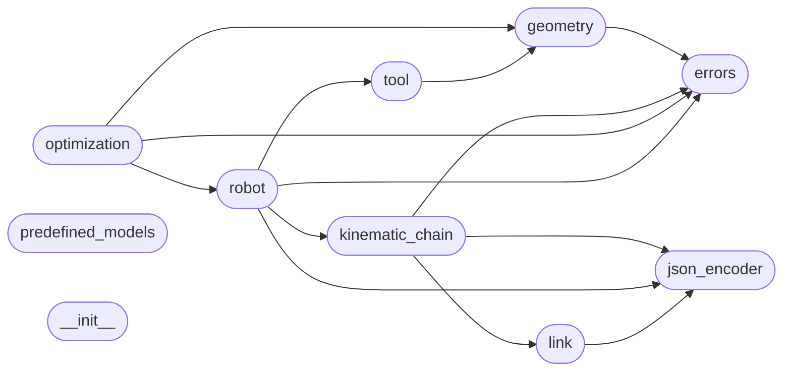

# Code Overview

[_Documentation generated by Documatic_](https://www.documatic.com)

<!---Documatic-section-Codebase Structure Python-start--->
## Codebase Structure Python

The codebase has a flat structure, with 10 code files.

<!---Documatic-block-system_architecture-start--->

<!---Documatic-block-system_architecture-end--->

# #
<!---Documatic-section-Codebase Structure Python-end--->

<!---Documatic-section-Important Functions-start--->
## Important Functions

<!---Documatic-block-important_funcs-start--->
<!---Documatic-block-most_used_funcs-start--->
### Most Utilised Functions

* [pybotics.geometry.matrix_2_vector](4-pybotics_geometry.md#pybotics.geometry.matrix_2_vector) (2 times)
* [pybotics.geometry.position_from_matrix](4-pybotics_geometry.md#pybotics.geometry.position_from_matrix) (2 times)
* [pybotics.geometry.vector_2_matrix](4-pybotics_geometry.md#pybotics.geometry.vector_2_matrix) (2 times)
<!---Documatic-block-most_used_funcs-end--->
<!---Documatic-block-important_funcs-end--->

# #
<!---Documatic-section-Important Functions-end--->

<!---Documatic-section-Class Hierarchy-start--->
## Class Hierarchy

<!---Documatic-block-Enum-start--->

	
<code>Enum</code> (Click to Expand!)

* [pybotics.geometry.OrientationConvention](4-pybotics_geometry.md#pybotics.geometry.OrientationConvention)

<!---Documatic-block-Enum-end--->

<!---Documatic-block-Exception-start--->

	
<code>Exception</code> (Click to Expand!)

* [pybotics.errors.PyboticsError](3-pybotics_errors.md#pybotics.errors.PyboticsError)

<!---Documatic-block-Exception-end--->

<!---Documatic-block-Sized-start--->

	
<code>Sized</code> (Click to Expand!)

* pybotics.kinematic_chain.KinematicChain
* pybotics.link.Link
* pybotics.robot.Robot

<!---Documatic-block-Sized-end--->

<!---Documatic-block-json.JSONEncoder-start--->

	
<code>json.JSONEncoder</code> (Click to Expand!)

* pybotics.json_encoder.JSONEncoder

<!---Documatic-block-json.JSONEncoder-end--->

<!---Documatic-block-pybotics.kinematic_chain.KinematicChain-start--->

	
<code>pybotics.kinematic_chain.KinematicChain</code> (Click to Expand!)

* pybotics.kinematic_chain.MDHKinematicChain

<!---Documatic-block-pybotics.kinematic_chain.KinematicChain-end--->

<!---Documatic-block-pybotics.link.Link-start--->

	
<code>pybotics.link.Link</code> (Click to Expand!)

* pybotics.link.MDHLink

<!---Documatic-block-pybotics.link.Link-end--->

<!---Documatic-block-pybotics.link.MDHLink-start--->

	
<code>pybotics.link.MDHLink</code> (Click to Expand!)

* pybotics.link.PrismaticMDHLink
* pybotics.link.RevoluteMDHLink

<!---Documatic-block-pybotics.link.MDHLink-end--->

# #
<!---Documatic-section-Class Hierarchy-end--->

[_Documentation generated by Documatic_](https://www.documatic.com)