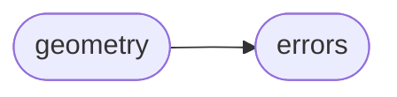
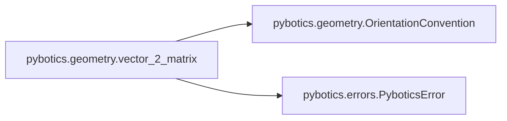

# Pybotics Geometry

[_Documentation generated by Documatic_](https://www.documatic.com)

<!---Documatic-section-Codebase Structure-start--->
## Codebase Structure

<!---Documatic-block-system_architecture-start--->

<!---Documatic-block-system_architecture-end--->

# #
<!---Documatic-section-Codebase Structure-end--->

<!---Documatic-section-pybotics.geometry.matrix_2_vector-start--->
## [pybotics.geometry.matrix_2_vector](4-pybotics_geometry.md#pybotics.geometry.matrix_2_vector)

<!---Documatic-section-matrix_2_vector-start--->
<!---Documatic-block-pybotics.geometry.matrix_2_vector-start--->
<details>
	<summary><code>pybotics.geometry.matrix_2_vector</code> code snippet</summary>

```python
def matrix_2_vector(matrix: npt.NDArray[np.float64], convention: OrientationConvention=OrientationConvention.EULER_ZYX) -> npt.NDArray[np.float64]:
    try:
        vector = globals()[f'_matrix_2_{convention.name.lower()}'](matrix)
        return vector
    except KeyError:
        raise NotImplementedError
```
</details>
<!---Documatic-block-pybotics.geometry.matrix_2_vector-end--->
<!---Documatic-section-matrix_2_vector-end--->

# #
<!---Documatic-section-pybotics.geometry.matrix_2_vector-end--->

<!---Documatic-section-pybotics.geometry.position_from_matrix-start--->
## [pybotics.geometry.position_from_matrix](4-pybotics_geometry.md#pybotics.geometry.position_from_matrix)

<!---Documatic-section-position_from_matrix-start--->
<!---Documatic-block-pybotics.geometry.position_from_matrix-start--->
<details>
	<summary><code>pybotics.geometry.position_from_matrix</code> code snippet</summary>

```python
def position_from_matrix(matrix: npt.NDArray[np.float64]) -> npt.NDArray[np.float64]:
    position = matrix[:-1, -1]
    return position
```
</details>
<!---Documatic-block-pybotics.geometry.position_from_matrix-end--->
<!---Documatic-section-position_from_matrix-end--->

# #
<!---Documatic-section-pybotics.geometry.position_from_matrix-end--->

<!---Documatic-section-pybotics.geometry.vector_2_matrix-start--->
## [pybotics.geometry.vector_2_matrix](4-pybotics_geometry.md#pybotics.geometry.vector_2_matrix)

<!---Documatic-section-vector_2_matrix-start--->


### Object Calls

* [pybotics.geometry.OrientationConvention](4-pybotics_geometry.md#pybotics.geometry.OrientationConvention)
* [pybotics.errors.PyboticsError](3-pybotics_errors.md#pybotics.errors.PyboticsError)

<!---Documatic-block-pybotics.geometry.vector_2_matrix-start--->
<details>
	<summary><code>pybotics.geometry.vector_2_matrix</code> code snippet</summary>

```python
def vector_2_matrix(vector: npt.NDArray[np.float64], convention: Union[OrientationConvention, str]=OrientationConvention.EULER_ZYX) -> npt.NDArray[np.float64]:
    translation_component = vector[:3]
    rotation_component = vector[-3:]
    if isinstance(convention, OrientationConvention):
        convention = convention.value
    try:
        OrientationConvention(convention)
    except ValueError as e:
        raise PyboticsError(str(e))
    transform_matrix = np.eye(4)
    for (axis, value) in zip(convention, rotation_component):
        current_rotation = globals()[f'rotation_matrix_{axis}'](value)
        transform_matrix = np.dot(transform_matrix, current_rotation)
    transform_matrix[:-1, -1] = translation_component
    return transform_matrix
```
</details>
<!---Documatic-block-pybotics.geometry.vector_2_matrix-end--->
<!---Documatic-section-vector_2_matrix-end--->

# #
<!---Documatic-section-pybotics.geometry.vector_2_matrix-end--->

<!---Documatic-section-pybotics.geometry.OrientationConvention-start--->
## [pybotics.geometry.OrientationConvention](4-pybotics_geometry.md#pybotics.geometry.OrientationConvention)

<!---Documatic-section-OrientationConvention-start--->
<!---Documatic-block-pybotics.geometry.OrientationConvention-start--->
<details>
	<summary><code>pybotics.geometry.OrientationConvention</code> code snippet</summary>

```python
class OrientationConvention(Enum):
    EULER_XYX = 'xyx'
    EULER_XYZ = 'xyz'
    EULER_XZX = 'xzx'
    EULER_XZY = 'xzy'
    EULER_YXY = 'yxy'
    EULER_YXZ = 'yxz'
    EULER_YZX = 'yzx'
    EULER_YZY = 'yzy'
    EULER_ZXY = 'zxy'
    EULER_ZXZ = 'zxz'
    EULER_ZYX = 'zyx'
    EULER_ZYZ = 'zyz'
    FIXED_XYX = 'xyx'
    FIXED_XYZ = 'zyx'
    FIXED_XZX = 'xzx'
    FIXED_XZY = 'yzx'
    FIXED_YXY = 'yxy'
    FIXED_YXZ = 'zxy'
    FIXED_YZX = 'xzy'
    FIXED_YZY = 'yzy'
    FIXED_ZXY = 'yxz'
    FIXED_ZXZ = 'zxz'
    FIXED_ZYX = 'xyz'
    FIXED_ZYZ = 'zyz'
```
</details>
<!---Documatic-block-pybotics.geometry.OrientationConvention-end--->
<!---Documatic-section-OrientationConvention-end--->

# #
<!---Documatic-section-pybotics.geometry.OrientationConvention-end--->

[_Documentation generated by Documatic_](https://www.documatic.com)